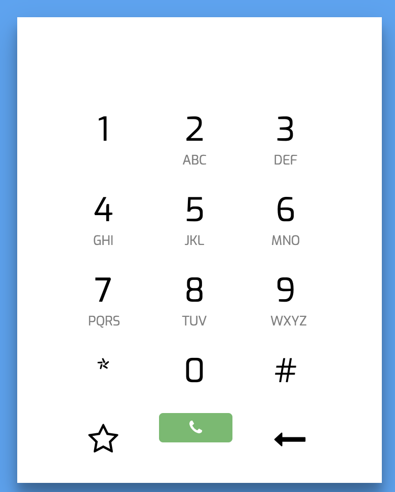

# Simple Whatsapp Dialpad (Malaysia format)

This is simple whatsapp dialpad. This allow user to dial in whatsapp number without saving their friends/contacts phone number. Just dial in, and you will be redirect to WhatsApp app via WhatsApp API. Upload this source code to your web hosting. No database configuration needed.

## Want to use for different countries?

Just simply edit in "**main.js**" file, and remove 6 in window.location. This '6' refer to Malaysia country code.
